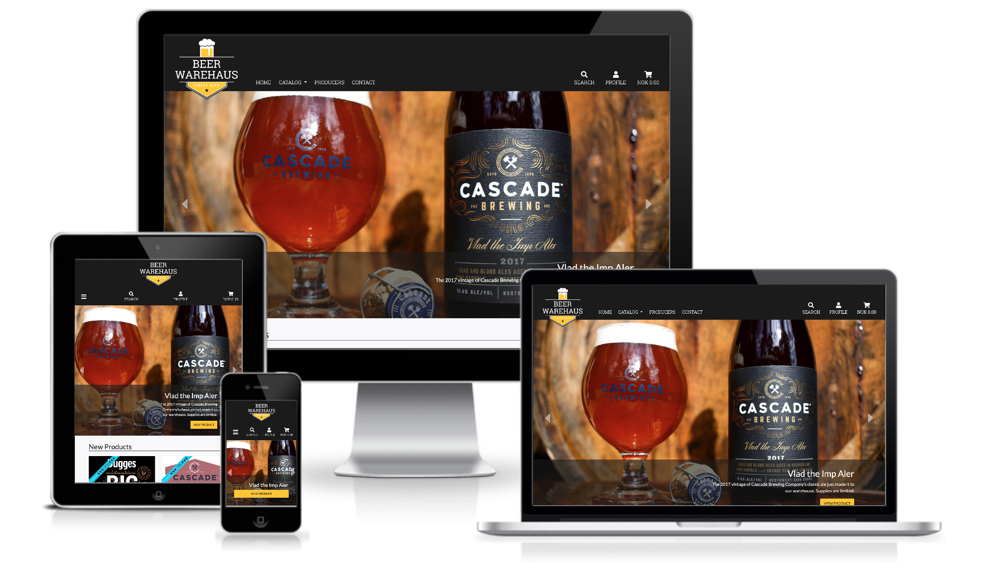
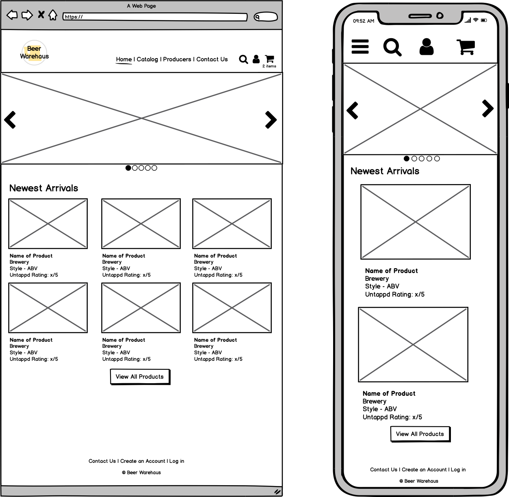
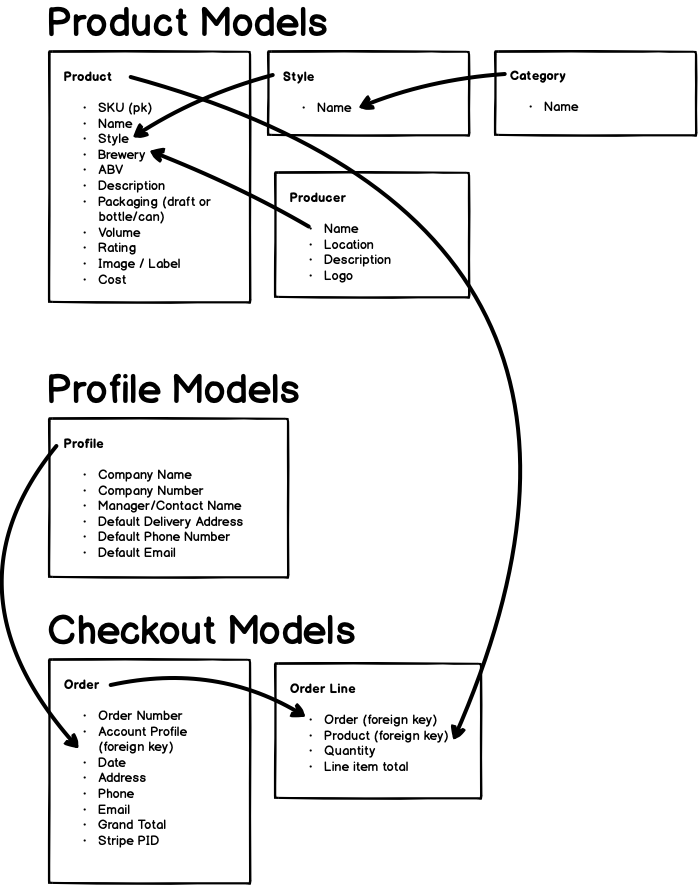
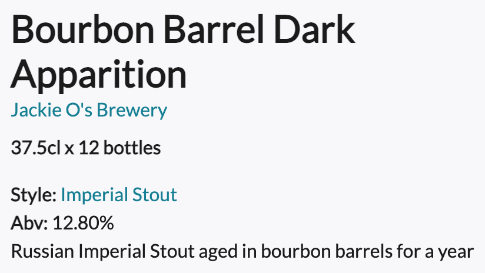

# Beer WareHaus

Beer WareHaus is an online shop for a hypothetical beer import and distribution company in Norway. The purpose of the site is to provide a simple intuitive ways for managers of bars and restaurants to browse and purchase products they wish to serve.
Additionally the site provides a number of tools allowing the shop owner to easily manage the products in the shop.



The site has been deployed to Heroku and can be viewed [here](https://beer-warehaus.herokuapp.com/).

## UX

### Project Goal

This project is my fourth and final Milestone Project in the Code Institute's Fullstack Development program. The purpose of this project was to create an e-commerce site using the Django framework, static file hosting with AWS, and a functional payment system with Stripe. This e-commerce site is fully functional and could be used by a real beer distribution company with minimal setup.

### User Stories

#### User Stories for Customers

| **As a restaurant or bar manager I would like to** | **So that I can**                             |
| -------------------------------------------------- | --------------------------------------------- |
| Browse products                                    | purchase what I need                          |
| Search products                                    | find something specific                       |
| Filter products by style                           | compare the offerings                         |
| Filter products by packaging (can, bottle, keg)    | choose serving style                          |
| See offerings by a specific producer               | get an idea of the producer's offer           |
| Buy a product                                      | serve it to customers                         |
| Pay using a card                                   | complete my purchase                          |
| Create a profile                                   | save my information and review past orders    |
| Update my profile information                      | be contacted by the importer                  |
| See my shopping cart before paying                 | know the cost and content before the purchase |
| Update my shopping cart                            | make decisions before the purchase            |
| See details about a product                        | make an informed purchasing decision          |
| View my order history                              | be reminded of previous purchases             |
| Receive an email confirmation about my order       | have archived information about it            |
| Contact the importer                               | know about the status of an order             |
| Know the newest arrivals                           | buy the freshest products                     |

#### User Stories for Shop Administrators

| **As an administrator I would like to**     | **So that I can**                                |
| ------------------------------------------- | ------------------------------------------------ |
| Add/Update/Remove a product                 | keep the store up to date                        |
| Add/Update/Remove a producer                | keep users informed about the latest information |
| Highlight specific products                 | sell products that need to move                  |
| Receive orders from customers in my mailbox | fulfill the orders                               |
| Mark a product as a new arrival             | entice customers with fresh products             |

### Wireframes

Following these user stories, wireframes were drawn to provide a starting point and guidance throughout the development process.



-   The full desktop wireframes can be found [here](readme-files/beer-warehaus-desktop.pdf)
-   The mobile wireframes can be found [here](readme-files/beer-warehaus-mobile.pdf)

### Data Structure

Before starting the development of the application, its models and their relationships were delineated:



### Design

The application was built using bootstrap and its responsive grid system.
Fonts and colors were carefully chosen to give the application a distinctive brand and feel.

#### Typography

Two fonts from [Google Fonts](https://fonts.google.com/) were used throughout the site:

1. **Roboto Slab** was used for the logo and the navigation of the site.


1. **Lato** was used for all the titles and contents of the site.



#### Colors

A simple color scheme was used to accentuate readability and usability.

-    `#1b1b1b - dark grey, primary color`

This color is used in the header's background and for fonts throughout the site. It was chosen for its simplicity and for providing contrast with other colors.

-    `#f8f8fb - off white, background-color`

This off white was chosen for the background color for the site as it provides good contrast with the other chosen colors, while being easier on the eyes than white.

-    `#ffc717 - gold, highlight color #1`

This yellow was used to highlight specific elements of the site to provide users with a visual aid on actions that can be performed, for example on buttons. It is also echoed in the site's logo, providing brand consistency.

-    `#077f94 - blue, highlight color #2`

This blue is used as a secondary highlight, meant to contrast with and compliment the gold buttons. They are used for links, and to help highlight product cards in listings.

-    `#00d9ff - blue, highlight color #2 alternative`

This lighter shade of blue was used as an alternative to the previously described blue and was used to highlight new products in listings.

## Features

### Existing Features

#### Home Page

-   The home page displays a slideshow with offerings highlighted by the administrator of the site
-   The home page lists the newest products to be added to the shop

#### Product Listing

The shop offers a number of solutions to make specific products easier to list and find.

-   A search function lets users find specific products
-   A product listing can be sorted by date of import, cost, and producer
-   A product listing can be filtered by packaging type (keg/drag, bottles/cans)

#### Product View

-   A user can view the details of a product, which includes the following:
    -   Product name
    -   Image
    -   Producer
    -   Description
    -   Style
    -   Alcohol contents
    -   Volume
    -   Number of units per order (for example, a box of 12 bottles)
    -   Product rating on untappd (if existing)
-   If registered and logged in, users can choose a quantity and add it to their cart

#### Producers Page

-   The producers page allows the import company to highlight reputable producers that it partners with
-   Each producer links to a description and a listing of their products offered in the shop

#### User Account

The creation of the account requires a valid email, a company name, a company number, and a password.
The creation of an account gives access to the following features:

-   Update of profile information
-   View the account's order history

#### Shopping Cart

-   Items chosen for purchase are placed in the shopping cart
-   The shopping cart displays subtotals for items placed in it and a grand total cost
-   Quantities for the products can be adjusted from within the shopping cart
-   Items can be removed from the shopping cart
-   A user can choose to proceed to payment

#### Payment

-   The checkout details and delivery information are pre-filled with the information provided in the user's profile, it can however be edited.
-   A summary of the order is displayed on the checkout page
-   Payment is made by card using [Stripe](https://stripe.com/)

#### Administrator features

-   On product pages, an administrator has additional links to edit a products information or remove it from the shop
-   An administrator has two options to add a new product:
    -   Entering the product's information manually
    -   Finding a product using a search on [Untappd](https://untappd.com/) using its API and importing it
-   An administrator can add a new producer either by entering the information manually or by performing a search on [Untappd](https://untappd.com/)
-   The administraor has the option of updating the images and text on the home page's carousel

### Features Left to implement

## Testing

## Deployment

Before deploying the application, ensure the following are installed:

-   Python 3
-   PIP
-   Git
-   Heroku CLI

The application relies on the following services, and accounts will have to be created for them:

-   [Untappd API](https://untappd.com/api/docs)
-   [Amazon AWS](https://aws.amazon.com/)
-   [Stripe](https://stripe.com/)
-   An email account, [GMail](https://mail.google.com/) is ideal as it is reliable and easy to set up.

### Local Deployment

These are the steps to deploy Beer WareHaus locally.

1.  From the application's [repository](https://github.com/jumboduck/beer-warehaus), click the "code" button and download the zip of the repository.

    Alternatively, you can clone the repository using the following line in your terminal:

        git clone https://github.com/jumboduck/beer-warehaus.git

2.  Access the folder in your terminal window and install the application's required modules using the following command:

        python -m pip -r requirements.txt

3.  Create a file containing your environmental variables called `env.py` at the root level of the application. It will need to contain the following lines and variables:

    ```
    import os

    os.environ["SECRET_KEY"] = "YOUR_DJANGO_SECRET_KEY"

    os.environ["UNTAPPD_CLIENT_ID"] = "YOUR_UNTAPPD_CLIEND_ID"
    os.environ["UNTAPPD_SECRET"] = "YOUR_UNTAPPD_SECRET"

    os.environ["STRIPE_PUBLIC_KEY"] = "YOUR_STRIPE_PUBLIC_KEY"
    os.environ["STRIPE_SECRET_KEY"] = "YOUR_STRIPE_SECRET_KEY"
    os.environ["STRIPE_WH_SECRET"] = "YOUR_STRIPE_WEBHOOK_SECRET"

    os.environ["DEVELOPMENT"] = "True"

    os.environ['EMAIL_HOST_USER'] = 'YOUR_EMAIL_USER'
    os.environ['EMAIL_HOST_PASSWORD'] = 'YOUR_EMAIL_PASSWORD'
    os.environ['EMAIL_HOST'] = 'smtp.google.com' # for gmail
    os.environ['DEFAULT_ORDER_EMAIL'] = 'DEFAULT_EMAIL'
    ```

    Please note that you will need to update the `SECRET_KEY` with your own secret key, as well as the Untappd and strip keys and secret variables with those provided by those applications.

    If you plan on pushing this application to a public repository, ensure that `env.py` is added to your `.gitignore` file to protect your secrets.

4.  The application can now be run locally. In your terminal, type the command `python3 manage.py runserver`. The application will be available in your browser at the address `http://localhost:8000`.

### Deployment to Heroku

To deploy Beer WareHaus to Heroku, use the following steps:

1. In Heroku create a new application.
2. From the heroku dashboard of your application, click on "Deploy", then "Deployment method" and select GitHub to connect the application to your github repository
3. In the Heroku Resources tab, navigate to the Add-Ons section and search for Heroku Postgres. The hobby level can be selected for this application.
4. Click on the "settings" tab and on the button labelled "Reveal Config Vars". The Postgres addon will have created a link to the Postgres database.
5. Add the following configuration variables to the application:

    | **VARIABLE**          | **VALUE**                                                          |
    | --------------------- | ------------------------------------------------------------------ |
    | AWS_ACCESS_KEY_ID     | The key provided by AWS                                            |
    | AWS_SECRET_ACCESS_KEY | The secret key provided by AWS                                     |
    | DATABASE_URL          | Postgres Database url provided by the addon                        |
    | DEFAULT_ORDER_EMAIL   | The email address orders will go to                                |
    | EMAIL_HOST            | The smtp host for the email                                        |
    | EMAIL_HOST_PASSWORD   | The password associated with the address that will send out emails |
    | EMAIL_HOST_USER       | The address that will send out emails                              |
    | SECRET_KEY            | Your Django secret key                                             |
    | STRIPE_PUBLIC_KEY     | The public key provided by Stripe                                  |
    | STRIPE_SECRET_KEY     | The secret key provided by Stripe                                  |
    | STRIPE_WH_SECRET      | The webhook secret provided by Stripe                              |
    | UNTAPPD_CLIENT_ID     | The client ID provided by Untappd                                  |
    | UNTAPPD_SECRET        | The secret provided by Untappd                                     |
    | USE_AWS               | True                                                               |

6. In the Heroku dashboard, deploy the application.
7. To view the site, click "View App"

## Technologies

-   HTML
-   CSS
-   JavaScript / jQuery
-   Python
-   Django
-   [Untappd API](https://untappd.com/api/docs)

## Tools Used

-   Github
-   VS Code
-   Balsamiq
-   Heroku
-   Adobe Photoshop
-   [TinyJPG](https://tinyjpg.com/) used to compress all images

## Credits

### Media

-   Beer WareHaus logo from from [freepik.com](https://www.freepik.com/)
-   Icon for "No photo available" image from [Flat Icons](https://www.flaticon.com/authors/flat-icons)

### Acknowledgements

-   Search functionality from [Julien Phalip](https://www.julienphalip.com/blog/adding-search-to-a-django-site-in-a-snap/)
